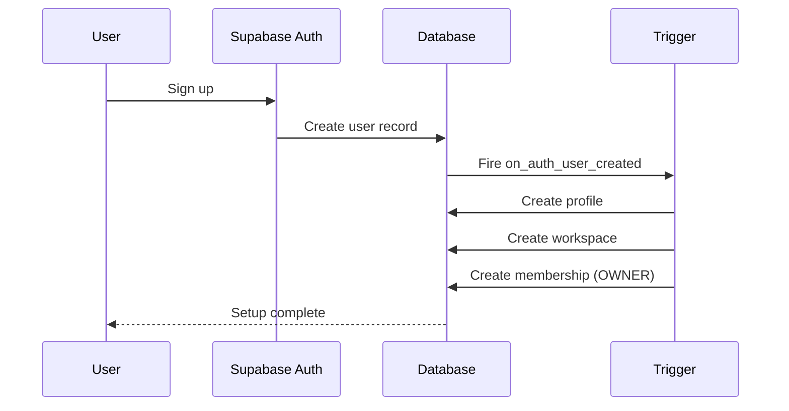
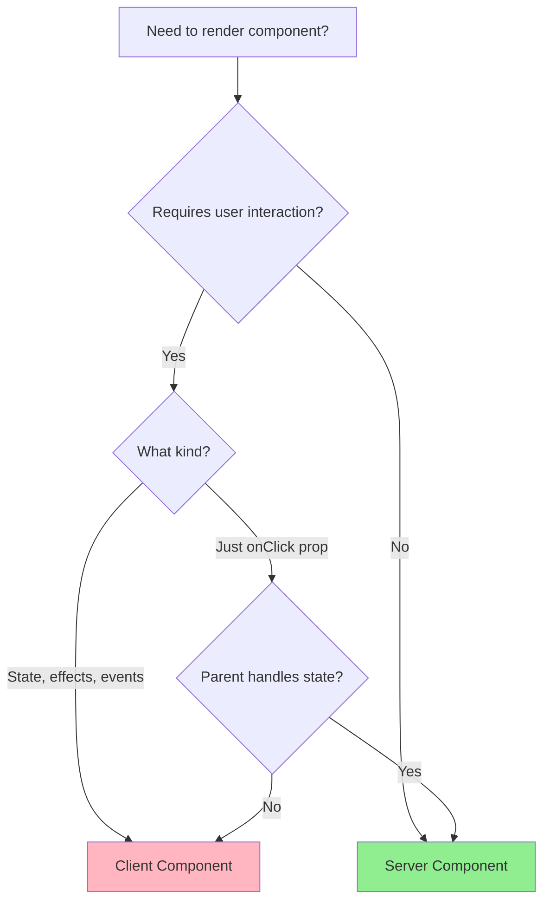
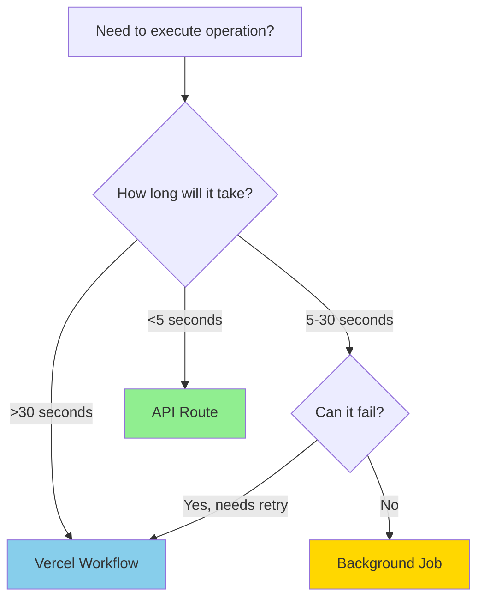
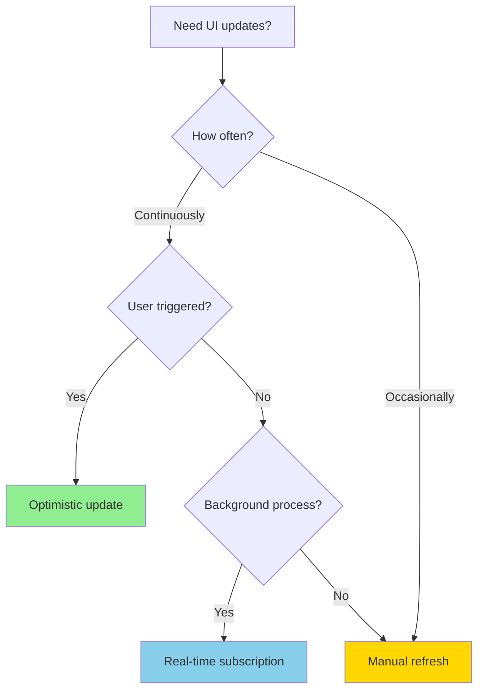

# Architecture

## Overview

IoZen is a monolithic Next.js application with modular boundaries designed for eventual service extraction.

**Stack:** Next.js 16 + React 19 + TypeScript 5 + Tailwind CSS 4 (shadcn/ui) + Prisma 6 + Supabase + Anthropic Claude

---

## Architectural Principles

1. **Start Monolithic, Think Modular** - Clear module boundaries, loose coupling
2. **Managed Services Over Custom** - Vercel Workflow, Supabase, third-party AI APIs
3. **Determinism & Idempotency** - Every step reproducible and safe to retry
4. **Security by Design** - RLS, principle of least privilege, input validation everywhere

---

## System Layers

```
┌─────────────────────────────────────┐
│         CLIENT LAYER                │
│  Next.js App Router + React 19      │
│  Server Components (default)        │
│  Client Components (when needed)    │
└─────────────┬───────────────────────┘
              │
              ▼
┌─────────────────────────────────────┐
│         API LAYER                   │
│  /api/* routes                      │
│  Zod validation                     │
│  requireAuth() / requireWorkspace() │
└─────────────┬───────────────────────┘
              │
              ▼
┌─────────────────────────────────────┐
│      BUSINESS LOGIC LAYER           │
│  /lib - Utilities & services        │
│  /workflows - Vercel Workflows      │
└─────────────┬───────────────────────┘
              │
              ▼
┌─────────────────────────────────────┐
│         DATA LAYER                  │
│  Prisma ORM                         │
│  Supabase PostgreSQL + Auth + RLS   │
└─────────────────────────────────────┘
```

---

## Database Schema

### Core Models

- **Profile** - User synced from Supabase Auth (UUID)
- **Workspace** - Multi-tenant container (CUID, unique slug)
- **WorkspaceMember** - Membership with roles (OWNER/ADMIN/MEMBER)
- **Chatflow** - Form definition with JSONB schema
- **ChatflowSubmission** - Collected responses
- **ConversationMessage** - Chat history
- **AuditLog** - All data changes

### Key Patterns

- Row Level Security (RLS) on all tables
- Signup trigger auto-creates profile + workspace
- Always filter queries by `workspaceId`
- CUID for IDs, snake_case columns

---

## Authentication Flow



### Security Rules

- Server-side: Always use `getUser()` not `getSession()`
- API routes: Use `requireAuth()` helper
- Validate workspace membership for all operations

---

## Workflow Architecture

Vercel Workflows handle long-running and async operations.

### Workflow Characteristics

- **Durable** - Survives deployments, crashes, restarts
- **Retriable** - Automatic retry with exponential backoff
- **Observable** - Built-in logging of all inputs/outputs

### Step Granularity

Create steps for:
- External API calls (Claude, OCR)
- Database writes (critical data)
- Long operations (>5 seconds)

Don't create steps for:
- Simple validation
- Data transformations
- Database reads

### Error Classification

```typescript
// Fatal - stop workflow
throw new FatalError('Invalid input')

// Retryable - auto-retry
throw new RetryableError('Rate limited')
```

---

## Decision Trees

### When to Use Server vs Client Components?



**Server Component** when:
- Fetching data from database
- Accessing backend resources
- Keeping sensitive information on server
- No user interaction needed

**Client Component** when:
- Using React hooks (useState, useEffect)
- Handling browser events (onClick, onChange)
- Using browser APIs (localStorage, window)
- Need interactivity or state management

---

### When to Use Workflows vs API Routes?



**Vercel Workflow** when:
- Long-running operations (>30s)
- Need automatic retries
- Multi-step processes
- Human-in-the-loop scenarios
- Must survive deployments

**API Route** when:
- Quick operations (<5s)
- Synchronous responses needed
- Simple CRUD operations

---

### When to Use Real-time Subscriptions?



**Real-time Subscription** when:
- Long-running background operations (AI generation, file processing)
- Live collaboration features
- Real-time notifications
- Dashboard metrics that update frequently

**Don't use** when:
- One-time data fetches (use server components)
- Rare updates (manual refresh is fine)
- Public endpoints (real-time requires authentication)

---

## Real-time Architecture

Supabase Real-time enables instant UI updates without polling.

### When to Use Real-time

Use Supabase Real-time subscriptions for:
- Long-running background operations (AI generation, file processing)
- Live collaboration features (multi-user editing)
- Real-time notifications (new submissions, status changes)
- Dashboard metrics that update frequently

Don't use for:
- One-time data fetches (use server components)
- Rare updates (manual refresh is fine)
- Public endpoints (real-time requires authentication)

### Real-time Pattern

```typescript
'use client'

import { useEffect, useState } from 'react'
import { createClient } from '@/lib/supabase/client'
import { useRouter } from 'next/navigation'

export function ChatflowMonitor({ chatflowId }: { chatflowId: string }) {
  const router = useRouter()
  const supabase = createClient()
  
  useEffect(() => {
    const channel = supabase
      .channel(`chatflow-${chatflowId}`)
      .on(
        'postgres_changes',
        {
          event: 'UPDATE',
          schema: 'public',
          table: 'Chatflow',
          filter: `id=eq.${chatflowId}`
        },
        () => {
          router.refresh() // Trigger server component re-fetch
        }
      )
      .subscribe()

    return () => {
      supabase.removeChannel(channel)
    }
  }, [chatflowId, router, supabase])

  return null // UI handled by server component
}
```

### Security Considerations

- Real-time uses existing RLS policies
- Client must have read permissions on subscribed table
- Filter subscriptions by `workspaceId` when possible
- Always validate data on the server after refresh

---

## Directory Structure

```
src/
├── app/                    # Next.js App Router
│   ├── (app)/             # Authenticated routes
│   ├── (public)/          # Public routes
│   ├── api/               # API routes
│   └── auth/              # Auth callbacks
├── components/
│   ├── features/          # Feature-specific components
│   │   ├── chatflow/      # Chatflow editor, fields, panels
│   │   ├── chat/          # Chat views (admin & public)
│   │   └── workspace/     # Workspace-related components
│   ├── layout/            # Navigation, containers, headers
│   └── ui/                # Reusable UI components (shadcn)
│       ├── button.tsx     # Universal button component
│       ├── forms/         # Form inputs and controls
│       ├── feedback/      # User feedback (alerts, toasts)
│       ├── data-display/  # Data presentation (cards, tables)
│       ├── layout/        # Layout containers (dialogs, sheets)
│       ├── overlays/      # Floating UI (tooltips, dropdowns)
│       └── navigation/    # Navigation elements (tabs, toggles)
├── lib/
│   ├── supabase/          # Auth clients
│   ├── api-auth.ts        # Auth helpers
│   ├── db.ts              # Prisma singleton
│   └── utils.ts           # Utilities
├── types/                 # TypeScript types
└── workflows/             # Vercel Workflows
```

---

## API Design

### RESTful Conventions

```
GET    /api/chatflows              # List
POST   /api/chatflows              # Create
GET    /api/chatflows/:id          # Read
PATCH  /api/chatflows/:id          # Update
DELETE /api/chatflows/:id          # Delete
POST   /api/chatflows/:id/publish  # Action
```

### Standard Pattern

```typescript
import { z } from 'zod'
import { requireAuth } from '@/lib/api-auth'

const schema = z.object({ name: z.string().min(1) })

export async function POST(req: Request) {
  const { auth, error } = await requireAuth()
  if (error) return error

  const body = await req.json()
  const validated = schema.parse(body)

  // Always filter by workspace
  const result = await prisma.chatflow.create({
    data: { ...validated, workspaceId: auth.workspaceId }
  })

  return NextResponse.json(result)
}
```

---

## Performance Considerations

1. **Server Components by default** - Only use `'use client'` when needed
2. **Select specific fields** - Don't fetch entire records
3. **Proper indexing** - Index foreign keys and common queries
4. **Workflow state < 100KB** - Pass IDs, not full objects

---

## Security Checklist

- [ ] Use `getUser()` not `getSession()` on server
- [ ] Use `requireAuth()` in all API routes
- [ ] Filter all queries by `workspaceId`
- [ ] Validate all input with Zod
- [ ] Never expose internal IDs in URLs
- [ ] RLS policies on all tables
